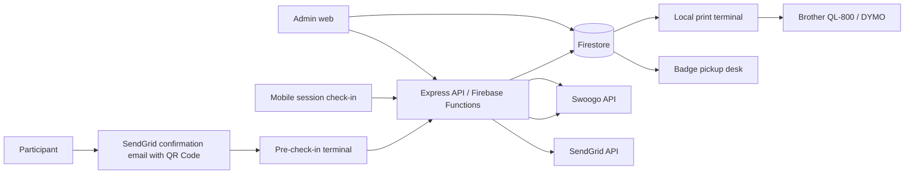
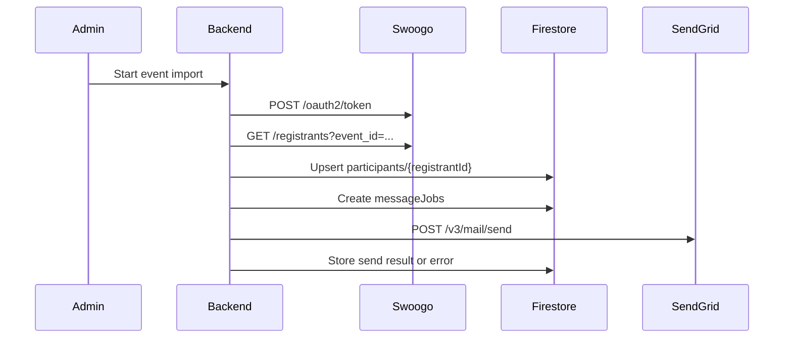
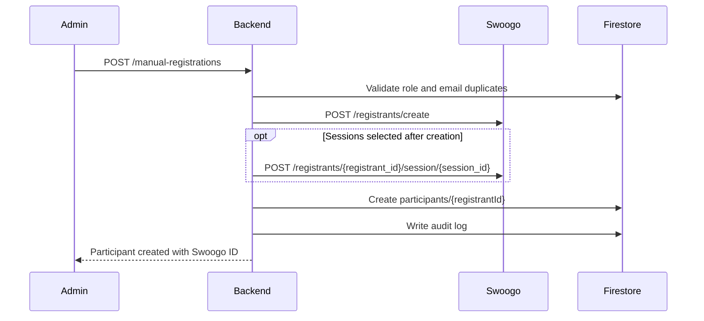
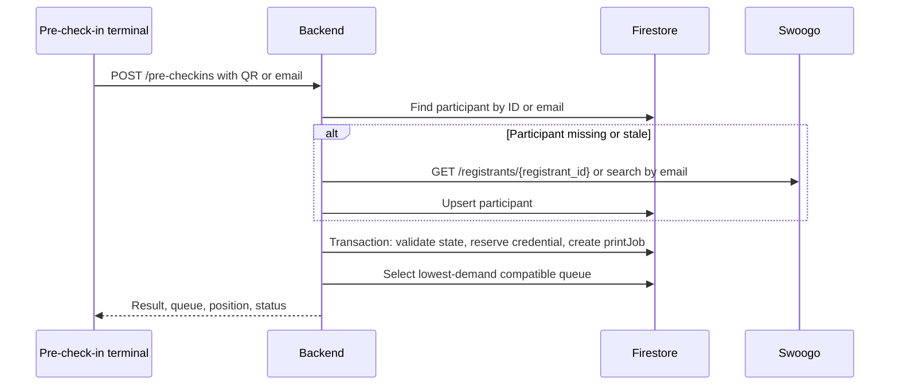
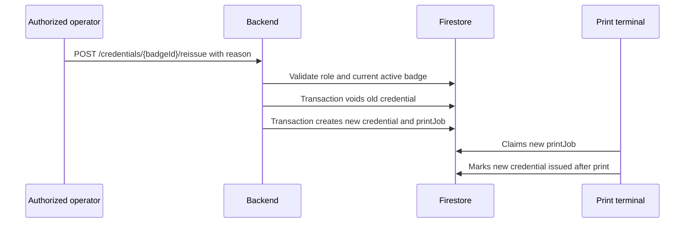
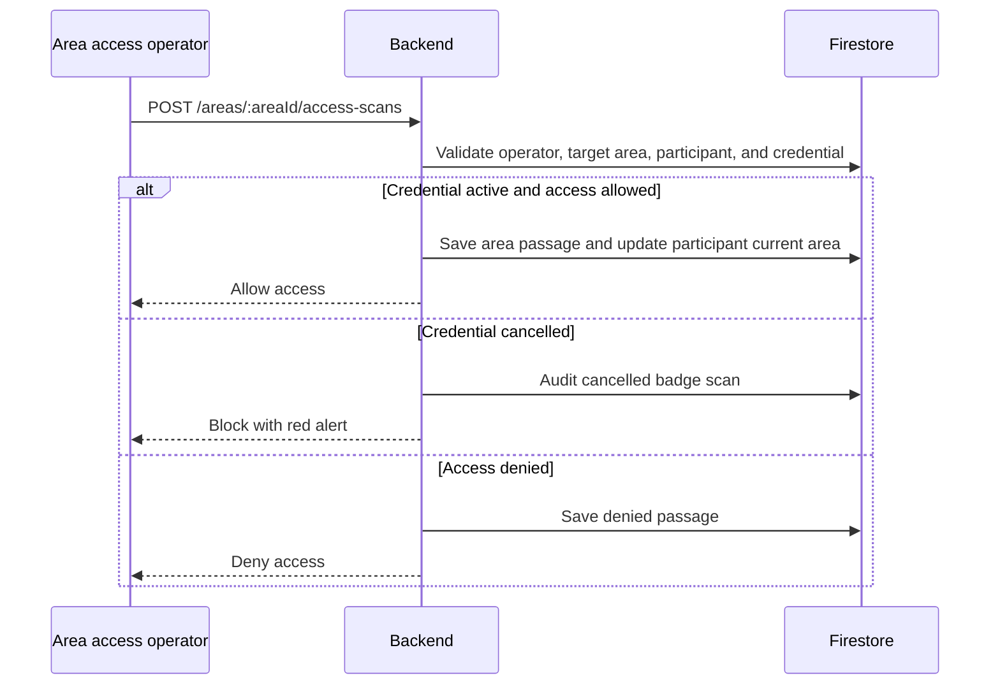

# Automatic Event Credentialing System

## Goal

Document the architecture for a multi-event credentialing platform that can:

- import registrants from Swoogo;
- manually register participants from the admin interface, creating the registrant in Swoogo and Firestore;
- send confirmation emails through SendGrid with a QR Code;
- run web-based pre-check-in terminals with QR Code scanning or email lookup;
- route participants to badge pickup queues based on registration type and queue demand;
- print badges automatically from local print terminals;
- issue and track physical credentials, each with its own credential QR Code;
- reissue badges for authorized users, automatically voiding the old badge;
- provide a visual badge layout editor;
- support session check-in from a mobile interface and sync it with Swoogo;
- support controlled-area access validation without creating Swoogo session scans;
- enforce controlled-area permissions by registration type and individual participant overrides;
- track the participant's current area, assuming a participant can be in only one controlled area at a time;
- move participants between areas when an area access or area-linked session scan is accepted;
- provide an event statistics dashboard with credentialing, queue, session, and area metrics;
- protect every interface with Firebase Auth, Firestore Security Rules, and event-scoped roles.

## Architecture Summary



Components:

- **Admin web**: configures events, Swoogo credentials, SendGrid settings, users, roles, queues, terminals, badge layouts, imports, manual registrations, sessions, and credential records.
- **Pre-check-in terminal**: authenticated web interface with camera scanning through `jsQR`, plus manual lookup by email.
- **Print terminal**: authenticated local UI/worker connected to a physical printer and associated with one or more queues.
- **Badge pickup interface**: may live inside the print terminal interface or as a separate queue desk screen. Operators verify documents and mark badge and swag delivery.
- **Mobile operations app**: responsive PWA with modes for Swoogo session check-in and controlled-area access validation.
- **Backend Express API**: authenticated HTTP API that validates Firebase ID tokens, applies sensitive business rules, calls Swoogo and SendGrid, allocates queues, creates print jobs, and writes audit logs.
- **Firestore**: operational database for event state, participants, credentialing status, credentials, queues, print jobs, sessions, operators, and logs. The system uses the named Firestore database `attendee-registry` instead of the project `(default)` database.
- **Swoogo API**: source of registrants and sessions, and destination for session check-in scans.
- **SendGrid API**: transactional email provider for confirmation messages and QR Code delivery.

## Key Decisions

1. **There are two different QR Codes**.
   The confirmation email QR Code identifies the Swoogo registrant by `registrant_id`. The printed credential QR Code identifies the physical credential and must use the format `BADGEID;epochSeconds;SWOOGOID`, where `BADGEID` is the Firestore auto-generated credential document ID.

2. **Pre-check-in and badge pickup are separate operational states**.
   Pre-check-in creates or confirms the participant in Firestore, assigns a queue, reserves a credential, and creates a print job. Badge pickup happens only after an operator verifies the participant document and marks the physical credential as delivered.

3. **Automatic printing should not depend on browser `window.print()`**.
   A local worker should listen to Firestore jobs, render the badge, and print through the operating system spooler. The browser may be used as a terminal dashboard, but the actual print action should be performed by a local process.

4. **Multi-event isolation is structural**.
   Each event has its own root document and subcollections. Every API call receives `eventId` and validates whether the authenticated user has permission for that event.

5. **Swoogo credentials are event-specific and must not be exposed to clients**.
   The event document stores integration metadata and secret references. If secrets must be stored in Firestore, store them encrypted and deny direct client reads with Security Rules.

6. **SendGrid credentials, senders, and templates are event-specific and database-driven**.
   Each event can use different SendGrid API credentials, sender identities, reply-to settings, template IDs, and template-purpose mappings. These settings must be stored in Firestore under the event configuration, while the raw API key remains stored as a secret reference or encrypted value that clients cannot read.

7. **Manual registration must create the Swoogo registrant before completing the local record**.
   This guarantees a valid `swoogoRegistrantId`, which is required for session registration and Swoogo session scans.

8. **Credential reissue always creates a new badge and voids the old one**.
   Authorized operators can reissue a badge, but the system must create a new Firestore credential document, use its auto-generated ID as the new `BADGEID`, generate a new credential QR Code, and immediately mark the previous active badge as `void`.

9. **Area access is not a Swoogo session check-in**.
   Controlled-area access scans are saved locally as participant passages in Firestore and must not call Swoogo session scan endpoints.

10. **A participant can be in only one controlled area at a time**.
    When a participant enters a new area, the backend updates the participant's current area and implicitly moves them out of the previous one.

11. **Access permissions are area-based**.
    An area can allow entire registration types and can also grant or deny access to specific participants individually.

12. **Sessions may be linked to areas**.
    When a QR Code is scanned for a session that is linked to an area, the system records the Swoogo session check-in and also moves the participant into that area locally.

## Swoogo Registrant Import And Confirmation Email



Steps:

1. The admin creates the local event and configures `swoogo.eventId`, Swoogo credentials, SendGrid credentials, sender identity, and event-specific templates.
2. The backend obtains a Swoogo token with `client_credentials` and caches it per event until expiration.
3. The backend paginates `GET /registrants` filtered by the Swoogo `event_id`.
4. Minimal Swoogo fields to import:
   `id,event_id,reg_type_id,email,first_name,last_name,company,job_title,registration_status,checked_in_at,updated_at,session_ids`.
5. Each registrant is stored at `events/{eventId}/participants/{registrantId}`.
6. The confirmation email QR Code contains the Swoogo `registrantId`.
7. The backend creates idempotent `messageJobs`.
8. SendGrid sends the email using a transactional template and `dynamic_template_data`.

Recommended message job:

```json
{
  "participantId": "26361060",
  "registrantId": "26361060",
  "eventId": "event-2026",
  "provider": "sendgrid",
  "channel": "email",
  "to": "participant@example.com",
  "fromEmail": "checkin@example.com",
  "fromName": "Event Check-in",
  "templateId": "d-sendgrid-template-id",
  "templatePurpose": "credential_confirmation",
  "qrPayload": "26361060",
  "qrImageUrl": "https://example.com/qrcodes/26361060.png",
  "status": "pending",
  "attempts": 0,
  "providerMessageId": null,
  "sendgridConfigSnapshot": {
    "integrationId": "primary",
    "fromEmail": "checkin@example.com",
    "fromName": "Event Check-in",
    "replyToEmail": "support@example.com",
    "templateId": "d-sendgrid-template-id"
  },
  "lastError": null,
  "sentAt": null,
  "createdAt": "serverTimestamp"
}
```

SendGrid send request shape:

```json
{
  "from": {
    "email": "checkin@example.com",
    "name": "Event Check-in"
  },
  "personalizations": [
    {
      "to": [{ "email": "participant@example.com", "name": "Ana Silva" }],
      "dynamic_template_data": {
        "firstName": "Ana",
        "eventName": "Event 2026",
        "qrPayload": "26361060",
        "qrImageUrl": "https://example.com/qrcodes/26361060.png"
      }
    }
  ],
  "template_id": "d-sendgrid-template-id",
  "categories": ["event-credentialing", "event-2026"]
}
```

Operational rules:

- Use SendGrid only from the backend.
- Store SendGrid integration settings per event in Firestore.
- Store the SendGrid API key as a secret manager reference or encrypted event integration field.
- Allow different events to use different SendGrid accounts, API keys, sender identities, and templates.
- Resolve templates by purpose, such as `credential_confirmation`, `manual_registration_confirmation`, `reissue_notification`, or `session_reminder`.
- Store a snapshot of the SendGrid sender/template configuration in every `messageJob`, so retries and audits can explain which event-level configuration was used.
- Treat SendGrid's accepted response as delivery submission, not final delivery.
- Optionally configure SendGrid Event Webhook to update `messageJobs` with delivered, bounced, deferred, dropped, opened, and clicked events.
- Do not resend if `status = sent` or `status = delivered` unless an admin explicitly requests it.
- Use a per-event template ID so each event can have its own copy and branding.

## Manual Participant Registration

The admin interface must allow staff to register participants who were not imported from Swoogo or who need to be added during the event. This flow creates the registrant in Swoogo and then persists the same participant in Firestore.



Minimum form fields:

- email;
- first name;
- last name;
- registration type;
- company;
- job title;
- optional phone number;
- optional package, if the event uses Swoogo packages;
- selected sessions, when the admin wants to enroll the participant immediately;
- `sendSwoogoEmail`, to allow or suppress Swoogo's automatic confirmation email;
- `sendCredentialEmail`, to send the SendGrid QR Code confirmation email after creation;
- `overrideCapacityErrors`, restricted to `event_admin`, for operational overrides.

Rules:

- Normalize email before checking duplicates.
- If a local participant with the same email already exists in the event, block or offer manual reconciliation.
- If Swoogo returns a duplicate error, search Swoogo by email and offer to link the existing registrant.
- Create the participant in Swoogo first with `POST /registrants/create`.
- Include `event_id`, `email`, `first_name`, `last_name`, `registration_status`, `package_id`, and `session_ids` when applicable.
- To add sessions after creation, call `POST /registrants/{registrant_id}/session/{session_id}`.
- Create `participants/{registrantId}` only after receiving the Swoogo registrant ID.
- Save `source.createdBy = manual_admin` and `source.manualRegistration = true`.
- Write an audit log containing the actor, request summary, Swoogo result, and local document ID.

Local model for a manually created participant:

```json
{
  "swoogoRegistrantId": 26361060,
  "swoogoEventId": 8048,
  "registrationTypeId": "staff",
  "registrationTypeName": "Staff",
  "email": "new@example.com",
  "normalizedEmail": "new@example.com",
  "firstName": "New",
  "lastName": "Participant",
  "fullName": "New Participant",
  "company": "Acme",
  "jobTitle": "Operations",
  "registrationStatus": "confirmed",
  "sessionIds": ["12345", "67890"],
  "credentialing": {
    "status": "imported",
    "precheckedAt": null,
    "precheckedBy": null,
    "queueId": null,
    "printJobId": null,
    "activeBadgeId": null,
    "activeCredentialId": null,
    "deliveredAt": null,
    "deliveredBy": null
  },
  "source": {
    "system": "swoogo",
    "createdBy": "manual_admin",
    "manualRegistration": true,
    "lastSyncedAt": "serverTimestamp"
  }
}
```

## Pre-check-in Flow



Rules:

- Accepted input:
  - confirmation QR Code containing `registrantId`;
  - normalized lowercase email.
- If the participant is already `prechecked`, `queued`, `printing`, `printed`, or `delivered`, return the current state without creating duplicates.
- If the participant does not exist locally, query Swoogo, validate `event_id`, and insert it.
- Create `printJobs/{jobId}` in a transaction. `jobId` may be deterministic, such as `badge-{registrantId}`.
- Create or reserve `credentials/{badgeId}` in the same transaction using a Firestore auto-generated document ID as `badgeId` and QR format `BADGEID;epochSeconds;SWOOGOID`.
- Select the queue by `registrationTypeId` and weighted demand.
- Write audit logs with operator, terminal, input mode, queue, and result.

Credentialing states:

```text
imported -> prechecked -> queued -> printing -> printed -> delivered
                              \-> print_failed -> queued
                              \-> cancelled
```

Minimum participant fields:

```json
{
  "swoogoRegistrantId": 26361060,
  "swoogoEventId": 8048,
  "registrationTypeId": "vip",
  "registrationTypeName": "VIP",
  "email": "participant@example.com",
  "normalizedEmail": "participant@example.com",
  "firstName": "Ana",
  "lastName": "Silva",
  "fullName": "Ana Silva",
  "company": "Acme",
  "jobTitle": "CMO",
  "registrationStatus": "confirmed",
  "credentialing": {
    "status": "queued",
    "precheckedAt": "serverTimestamp",
    "precheckedBy": "uid",
    "queueId": "vip-01",
    "printJobId": "badge-26361060",
    "activeBadgeId": "a7Kx9Qm2Pz4R8tY6uV3n",
    "activeCredentialId": "a7Kx9Qm2Pz4R8tY6uV3n;1781269200;26361060",
    "deliveredAt": null,
    "deliveredBy": null
  },
  "source": {
    "system": "swoogo",
    "lastSyncedAt": "serverTimestamp",
    "updatedAt": "2026-06-12 10:00:00"
  }
}
```

## Queues And Allocation

Each queue represents an operational pickup line. A queue can accept one or more registration types.

Example:

```json
{
  "name": "VIP 1",
  "status": "active",
  "acceptedRegistrationTypeIds": ["vip", "speaker"],
  "priority": 10,
  "terminalIds": ["printer-mac-01", "printer-pi-02"],
  "metrics": {
    "pending": 4,
    "printing": 1,
    "readyForPickup": 2,
    "lastAssignedAt": "serverTimestamp"
  }
}
```

Recommended allocation algorithm:

1. Find active queues that accept `registrationTypeId`.
2. If no queue accepts it, use the event default queue.
3. Calculate score:
   `pending * 3 + printing * 2 + readyForPickup + priorityPenalty`.
4. Pick the lowest score.
5. Update queue metrics in the same transaction that creates `queueEntries`, `credentials`, and `printJobs`.

Small events can operate with:

- 1 pre-check-in terminal;
- 1 print terminal;
- 1 default queue.

Larger events can scale any of these elements without changing the data model.

## Print Terminal

Responsibilities:

- authenticate with Firebase Auth using an operator or terminal account;
- load `events/{eventId}/printTerminals/{terminalId}`;
- listen to `printJobs` where `status = queued` and `queueId in terminal.queueIds`;
- claim a job with a transaction, changing it to `printing`;
- render the badge with the active layout;
- print locally;
- mark the job as `printed` or `print_failed`;
- allow authorized reprints;
- display credentials ready for pickup.

Print job model:

```json
{
  "participantId": "26361060",
  "queueId": "vip-01",
  "terminalId": null,
  "layoutId": "default-62x100",
  "credentialBadgeId": "a7Kx9Qm2Pz4R8tY6uV3n",
  "credentialId": "a7Kx9Qm2Pz4R8tY6uV3n;1781269200;26361060",
  "status": "queued",
  "attempts": 0,
  "priority": 100,
  "createdAt": "serverTimestamp",
  "claimedAt": null,
  "printedAt": null,
  "error": null,
  "payloadSnapshot": {
    "credentialQrPayload": "a7Kx9Qm2Pz4R8tY6uV3n;1781269200;26361060",
    "fullName": "Ana Silva",
    "firstName": "Ana",
    "company": "Acme",
    "jobTitle": "CMO"
  }
}
```

## Credential Issuance And Control

The printed credential must be treated as its own entity. It is not just the participant, because the same participant may have reprints, voided credentials, lost credentials, or badge replacements.

The logical credential ID and the printed QR Code value must use this format:

```text
BADGEID;epochSeconds;SWOOGOID
```

Example:

```text
a7Kx9Qm2Pz4R8tY6uV3n;1781269200;26361060
```

Fields:

- `BADGEID`: Firestore auto-generated document ID for `events/{eventId}/credentials/{badgeId}`. This must be random and non-sequential.
- `epochSeconds`: Unix timestamp in seconds at credential generation time.
- `SWOOGOID`: participant `swoogoRegistrantId`.

Generation rules:

- Generate `BADGEID` by creating a Firestore credential document reference in the backend and using `ref.id`.
- Never use predictable sequential IDs for `BADGEID`, because a sequence makes brute-force credential guessing easier.
- Generate the credential QR Code before printing, because the print worker needs the value in the badge layout.
- Store the composed value at `credentials/{badgeId}.credentialId` and `credentials/{badgeId}.qrPayload`.
- When the QR Code is scanned later, validate that `BADGEID`, timestamp, and `SWOOGOID` match an active Firestore credential.
- In session check-in, accept the old confirmation QR Code only as fallback. When the QR Code is from a printed credential, validate the credential and use the `SWOOGOID` for Swoogo.

States:

```text
reserved -> printing -> issued -> delivered
                    \-> failed
issued -> void
delivered -> void
```

Credential model:

```json
{
  "badgeId": "a7Kx9Qm2Pz4R8tY6uV3n",
  "credentialId": "a7Kx9Qm2Pz4R8tY6uV3n;1781269200;26361060",
  "participantId": "26361060",
  "swoogoRegistrantId": 26361060,
  "issuedAtEpochSeconds": 1781269200,
  "qrPayload": "a7Kx9Qm2Pz4R8tY6uV3n;1781269200;26361060",
  "status": "issued",
  "printJobId": "badge-26361060",
  "queueId": "vip-01",
  "terminalId": "printer-mac-01",
  "layoutId": "default-62x100",
  "issuedAt": "serverTimestamp",
  "issuedBy": "uid-or-terminal",
  "deliveredAt": null,
  "deliveredBy": null,
  "voidedAt": null,
  "voidedBy": null,
  "voidReason": null,
  "reprintOfBadgeId": null,
  "reprintOfCredentialId": null
}
```

Recommended flow:

1. During pre-check-in, the backend creates or reserves a credential with `status = reserved` and links it to the print job.
2. `printJob.payloadSnapshot.credentialQrPayload` receives the credential payload.
3. When the terminal claims the job, it moves the credential to `printing`.
4. After a successful print, the terminal moves the credential to `issued`, the participant to `printed`, `participant.credentialing.activeBadgeId` to the Firestore credential document ID, and `participant.credentialing.activeCredentialId` to the composed value.
5. During pickup, the operator verifies the document, hands over badge and swag, and moves the credential to `delivered`.
6. On reprint, the previous credential should be marked `void` or kept as `issued` with a `reprinted` reason depending on event policy. The new credential gets a new Firestore auto ID and timestamp.

Operational controls:

- prevent two active `delivered` credentials for the same participant unless an `event_admin` explicitly allows it;
- require a reason for every reprint;
- keep full credential history per participant;
- allow lookup by `BADGEID`, `SWOOGOID`, email, and name;
- write audit logs for `credential.reserved`, `credential.issued`, `credential.delivered`, `credential.voided`, and `credential.reprinted`.

### Badge Reissue

The admin and print/pickup interfaces must provide a reissue action for users with explicit permission. Reissue is different from retrying a failed print: it invalidates the previous active badge and creates a new physical credential.

Required permission:

- `credential_reissuer`, or `event_admin`.

Reissue flow:



Rules:

- Reissue requires a reason, such as `lost_badge`, `damaged_badge`, `name_correction`, `wrong_badge`, or `admin_override`.
- The backend must create a new Firestore credential document, use the auto-generated document ID as `BADGEID`, and generate a new composed credential ID in the format `BADGEID;epochSeconds;SWOOGOID`.
- The previous active credential must be marked `void` in the same transaction that creates the new credential.
- The previous credential should store `voidReason`, `voidedBy`, `voidedAt`, `replacedByBadgeId`, and `replacedByCredentialId`.
- The new credential should store `reissueOfBadgeId`, `reissueOfCredentialId`, and `reissueReason`.
- The participant document must be updated to point `credentialing.activeBadgeId` and `credentialing.activeCredentialId` to the new credential.
- If the new print fails, the new credential may move to `failed`, but the previous credential must remain voided unless an `event_admin` explicitly restores it through an audited exception flow.

Additional fields for voided credentials:

```json
{
  "status": "void",
  "voidReason": "lost_badge",
  "voidedAt": "serverTimestamp",
  "voidedBy": "firebase-uid",
  "replacedByBadgeId": "p9Lm4Qx8Tz2Va6Bc1Nd0",
  "replacedByCredentialId": "p9Lm4Qx8Tz2Va6Bc1Nd0;1781272800;26361060"
}
```

Additional fields for the replacement credential:

```json
{
  "badgeId": "p9Lm4Qx8Tz2Va6Bc1Nd0",
  "credentialId": "p9Lm4Qx8Tz2Va6Bc1Nd0;1781272800;26361060",
  "status": "reserved",
  "reissueOfBadgeId": "a7Kx9Qm2Pz4R8tY6uV3n",
  "reissueOfCredentialId": "a7Kx9Qm2Pz4R8tY6uV3n;1781269200;26361060",
  "reissueReason": "lost_badge",
  "reissuedBy": "firebase-uid",
  "reissuedAt": "serverTimestamp"
}
```

### Cancelled Badge Scan UI

Any interface that scans a credential QR Code must validate the credential before accepting the scan. If the scanned credential exists but `status = void`, the UI must show a blocking alert with a red background.

Required UI behavior:

- full-screen or prominent red background;
- title: `Badge cancelled`;
- show participant name, old `BADGEID`, cancellation reason, cancellation time, and replacement `BADGEID` when available;
- prevent session check-in, area access, badge pickup, or delivery actions using the cancelled badge;
- offer a safe path to search the participant and locate the active badge, depending on the operator role;
- write an audit log entry `credential.cancelled_scan_detected`.

Example response for a cancelled badge:

```json
{
  "result": "blocked",
  "reason": "credential_void",
  "alertColor": "red",
  "message": "Badge cancelled",
  "participantId": "26361060",
  "participantName": "Ana Silva",
  "scannedBadgeId": "a7Kx9Qm2Pz4R8tY6uV3n",
  "activeBadgeId": "p9Lm4Qx8Tz2Va6Bc1Nd0",
  "voidReason": "lost_badge"
}
```

## Recommended Printing Strategy

**Preferred approach: local worker + OS spooler.**

- On Raspberry Pi: use Linux with CUPS and a USB printer validated for the deployment.
- On macOS: use the system print queue.
- The worker renders PDF/PNG at exact physical dimensions and sends it to the local spooler.
- The browser stays free of print dialogs.

Conceptual worker command:

```bash
lp -d "$PRINTER_NAME" -o media=Custom.62x100mm badge.pdf
```

### Printer Choice

Recommended first option: **Brother QL-800**, especially if Raspberry Pi support is required.

Reasons:

- USB direct thermal label printer with automatic cutter and DK label support.
- Supports labels up to 62 mm wide, enough for simple badges.
- Has a known raster-printing ecosystem for local automation.
- Official product material declares Windows/macOS compatibility. For Raspberry Pi, validate Linux/CUPS support in the final environment before purchasing at scale.

DYMO LabelWriter should be considered mainly for macOS/Windows deployments:

- The current public product documentation is clearer for LabelWriter 550, 550 Turbo, and 5XL than for a "DYMO 650" model.
- Validate Linux/Raspberry Pi support before choosing DYMO for field terminals.

### Browser Direct Printing

`window.print()` opens the browser print dialog. For an operation without user button presses or dialogs, the reliable approach is a local worker. Chrome kiosk mode can reduce interaction in controlled deployments, but it still depends on OS configuration, the default printer, and browser policy.

## Badge Layout Editor

The admin interface must let event staff create and version badge layouts by event and registration type.

Supported fields:

- credential QR Code;
- full name;
- first name;
- company;
- job title;
- fields that can be hidden per layout.

Characteristics:

- canvas/SVG layout with physical dimensions in millimeters;
- optional grid and snapping;
- preview with sample data;
- controls for position, width, height, font, weight, alignment, and visibility;
- event default layout;
- override by `registrationTypeId`;
- layout version history for consistent reprints.

Example layout:

```json
{
  "name": "Default 62x100",
  "size": { "widthMm": 62, "heightMm": 100 },
  "dpi": 300,
  "fields": [
    {
      "id": "qr",
      "type": "qr",
      "source": "credentialQrPayload",
      "visible": true,
      "xMm": 4,
      "yMm": 4,
      "widthMm": 22,
      "heightMm": 22
    },
    {
      "id": "fullName",
      "type": "text",
      "source": "fullName",
      "visible": true,
      "xMm": 4,
      "yMm": 32,
      "widthMm": 54,
      "fontSizePt": 18,
      "fontWeight": 700,
      "align": "center",
      "maxLines": 2
    },
    {
      "id": "company",
      "type": "text",
      "source": "company",
      "visible": true,
      "xMm": 4,
      "yMm": 54,
      "widthMm": 54,
      "fontSizePt": 10,
      "fontWeight": 400,
      "align": "center",
      "maxLines": 1
    }
  ]
}
```

## Mobile Session Check-in

Flow:

1. Operator signs in on mobile.
2. Operator selects event and session.
3. Camera scans QR Code with `jsQR`.
4. Backend identifies the QR Code type:
   - simple `registrantId` from the confirmation email;
   - `BADGEID;epochSeconds;SWOOGOID` from the printed credential.
5. Backend validates permission, participant, session, and active credential when applicable.
6. Backend writes `sessionCheckins/{sessionId_registrantId}` in Firestore.
7. Backend calls Swoogo `POST /scans/registrant/{registrant_id}/session/{session_id}` using `SWOOGOID`.
8. If the session is linked to an access area, backend also records an area passage and moves the participant to the session area.
9. The UI shows success, duplicate, permission error, invalid participant, invalid credential, cancelled badge, access denied, or sync failure.

Use of `prevent_check_in`:

- `false` or omitted: the Swoogo session scan may update the overall registrant status to `attended`.
- `true`: records session attendance without changing the registrant's overall event status.

Model:

```json
{
  "sessionId": "12345",
  "registrantId": "26361060",
  "credentialBadgeId": "a7Kx9Qm2Pz4R8tY6uV3n",
  "credentialId": "a7Kx9Qm2Pz4R8tY6uV3n;1781269200;26361060",
  "accessAreaId": "auditorium-1",
  "areaPassageId": "area-passage-id",
  "operatorUid": "firebase-uid",
  "deviceId": "iphone-door-a",
  "status": "synced",
  "swoogoScanId": 696,
  "checkedInAt": "serverTimestamp",
  "syncedAt": "serverTimestamp",
  "error": null
}
```

Optional offline mode:

- store scans locally as `pending_sync`;
- sync when connectivity returns;
- prevent duplicates with deterministic key `sessionId_registrantId`;
- clearly show the operator when a scan has not yet been confirmed in Swoogo.

## Mobile Area Access

The mobile app must also provide a badge reader mode for controlled areas, such as the lobby, VIP lounge, auditoriums, backstage areas, staff-only rooms, expo entrances, or any area where the goal is to validate the badge and record participant movement without counting it as a Swoogo session.

Concepts:

- **Area**: the controlled physical area and the persistent permission/presence target, such as `lobby`, `vip`, `auditorium-1`, or `auditorium-2`.
- **Gate**: an operational reader location or UI route name for an area access scanner. In the current product model, operators select an area directly; separate gate configuration is not required.
- **Area permission**: a rule deciding whether a participant may enter an access area.
- **Area passage**: a local record that the participant attempted to enter an area.
- **Current area**: the last accepted area where the participant is considered to be.

Important rule:

- Area access scans are local operational records only.
- Area access must not call `POST /scans/registrant/{registrant_id}/session/{session_id}`.
- Area access must not create or update Swoogo session attendance.
- A participant can be in only one area at a time. A successful passage to a new area replaces the participant's previous current area.



Area configuration:

```json
{
  "name": "VIP Lounge",
  "status": "active",
  "type": "controlled_area",
  "allowedRegistrationTypeIds": ["vip", "speaker"],
  "deniedRegistrationTypeIds": [],
  "allowedBadgeStatuses": ["issued", "delivered"],
  "participantOverrideMode": "allow_and_deny",
  "defaultDecision": "deny",
  "occupancy": {
    "currentCount": 42,
    "lastRecalculatedAt": "serverTimestamp"
  }
}
```

Individual participant override:

```json
{
  "participantId": "26361060",
  "decision": "allow",
  "reason": "speaker_guest",
  "validFrom": null,
  "validUntil": null,
  "createdBy": "firebase-uid",
  "createdAt": "serverTimestamp"
}
```

Recommended override path:

```text
events/{eventId}/accessAreas/{areaId}/participantOverrides/{registrantId}
```

Permission evaluation order:

1. Block immediately if the credential is missing, malformed, from another event, not active, or cancelled.
2. If there is an individual participant override with `decision = deny`, deny access.
3. If there is an individual participant override with `decision = allow`, allow access.
4. If the participant's `registrationTypeId` is in `deniedRegistrationTypeIds`, deny access.
5. If the participant's `registrationTypeId` is in `allowedRegistrationTypeIds`, allow access.
6. Otherwise apply `defaultDecision`, usually `deny`.

Area scanner configuration:

```json
{
  "selectedAreaId": "vip-lounge",
  "operatorRole": "gate_operator"
}
```

Area access scan flow:

1. Operator selects event and controlled area.
2. Camera scans a printed credential QR Code.
3. Backend parses `BADGEID;epochSeconds;SWOOGOID`.
4. Backend validates the credential exists and belongs to the selected event.
5. If credential status is `void`, return the red cancelled badge alert.
6. Backend validates access rules for the selected area, including registration type and individual participant overrides.
7. If allowed, backend writes a passage record to Firestore, both in the event-level area passage log and in the participant's own access history.
8. If allowed, backend updates `participants/{registrantId}.presence.currentAreaId` to the selected area and stores the previous area in the passage record.
9. UI shows allow, deny, or blocked result immediately.

Passage record:

```json
{
  "areaId": "vip-lounge",
  "fromAreaId": "lobby",
  "toAreaId": "vip-lounge",
  "participantId": "26361060",
  "swoogoRegistrantId": 26361060,
  "credentialBadgeId": "p9Lm4Qx8Tz2Va6Bc1Nd0",
  "credentialId": "p9Lm4Qx8Tz2Va6Bc1Nd0;1781272800;26361060",
  "operatorUid": "firebase-uid",
  "deviceId": "iphone-area-a",
  "direction": "entry",
  "result": "allowed",
  "reason": null,
  "scannedAt": "serverTimestamp",
  "metadata": {
    "registrationTypeId": "vip",
    "areaName": "VIP Lounge"
  }
}
```

Recommended write paths:

```text
events/{eventId}/areaPassages/{passageId}
events/{eventId}/participants/{registrantId}/accessPassages/{passageId}
```

Participant summary update:

```json
{
  "access": {
    "lastAreaId": "vip-lounge",
    "lastAreaName": "VIP Lounge",
    "lastAreaResult": "allowed",
    "lastPassageAt": "serverTimestamp",
    "passageCount": 3
  },
  "presence": {
    "currentAreaId": "vip-lounge",
    "currentAreaName": "VIP Lounge",
    "currentAreaEnteredAt": "serverTimestamp",
    "previousAreaId": "lobby",
    "lastMovementSource": "area_access"
  }
}
```

Denied or blocked scans should also be stored so operations can audit attempted access:

```json
{
  "result": "blocked",
  "reason": "credential_void",
  "credentialBadgeId": "a7Kx9Qm2Pz4R8tY6uV3n",
  "activeBadgeId": "p9Lm4Qx8Tz2Va6Bc1Nd0",
  "uiAlert": {
    "color": "red",
    "title": "Badge cancelled"
  }
}
```

Area access UI states:

- `Allowed`: green background, short success sound/vibration, participant name and credential ID.
- `Denied`: amber or neutral warning, reason shown, no passage counted as allowed.
- `Badge cancelled`: red background, blocking alert, old badge ID and active replacement badge when available.
- `Invalid badge`: red background, no participant found or malformed QR Code.
- `Offline pending`: only if offline mode is explicitly enabled for area access; otherwise area access should require online validation.

Example area movement:

- Participant receives credential and scans into `lobby`; `currentAreaId = lobby`.
- Participant scans at the VIP area reader. If the badge grants VIP access, `currentAreaId = vip-lounge` and the previous area is stored as `lobby`.
- Participant later scans into Session A linked to `auditorium-1`; the session check-in is sent to Swoogo, and the local area state moves to `auditorium-1`.

## Session Administration

The admin interface must allow:

- importing sessions from Swoogo;
- creating a session locally and in Swoogo;
- editing basic fields and syncing them;
- linking a session to an access area, such as `auditorium-1` or `vip-lounge`;
- archiving or disabling a session locally;
- mapping sessions to operators;
- tracking check-in counts.

Minimum fields to create a Swoogo session:

- `event_id`;
- `name`;
- `date`;
- optional `start_time`, `end_time`, `capacity`, `location_id`, `track_id`, `timezone`, `description`, `selection_control`.

Firestore stores the local snapshot and remote IDs:

```json
{
  "swoogoSessionId": 12345,
  "swoogoEventId": 8048,
  "name": "Keynote",
  "date": "2026-08-10",
  "startTime": "09:00:00",
  "endTime": "10:00:00",
  "capacity": 500,
  "accessAreaId": "auditorium-1",
  "accessAreaName": "Auditorium 1",
  "enforceAreaPermissionForSessions": false,
  "status": "active",
  "lastSyncedAt": "serverTimestamp"
}
```

When `accessAreaId` is set:

- a successful mobile session check-in moves the participant to the linked area;
- the move is recorded locally as an area passage with `source = session_checkin`;
- the Swoogo session scan still happens normally;
- the area movement must not create an additional Swoogo session scan.
- if `enforceAreaPermissionForSessions = true`, the backend must also validate the linked area's registration-type rules and participant-specific overrides before allowing the session check-in.

## Authentication And Roles

All interfaces use Firebase Auth with email/password sign-in. The backend validates the Firebase ID token for every request and resolves event-scoped roles from Firestore before allowing event data access or mutations.

Recommended roles:

- `super_admin`: manages all events, users, and integrations.
- `event_admin`: manages one specific event.
- `event_manager`: operates event settings without managing global users.
- `precheckin_operator`: uses pre-check-in terminals.
- `print_operator`: uses print and badge pickup terminals.
- `credential_reissuer`: can void an active badge and issue a replacement badge.
- `session_operator`: performs session check-in.
- `gate_operator`: validates badges at controlled areas without creating Swoogo session scans. The role name is retained for operator familiarity, but the scoped resource is the selected area.
- `area_manager`: configures access areas and participant-specific access overrides.
- `viewer`: reads dashboards and reports.

Custom claims:

- use only for small global flags, such as `superAdmin: true`;
- do not store the full event access list in custom claims;
- event-scoped permissions live in Firestore.

User model:

```json
{
  "email": "operator@example.com",
  "displayName": "Operator A",
  "status": "active",
  "globalRoles": ["viewer"],
  "createdAt": "serverTimestamp",
  "updatedAt": "serverTimestamp"
}
```

Event member model:

```json
{
  "uid": "firebase-uid",
  "roles": ["precheckin_operator", "session_operator", "gate_operator"],
  "allowedQueueIds": ["default", "vip-01"],
  "allowedSessionIds": ["12345", "67890"],
  "allowedAreaIds": ["lobby", "vip-lounge", "auditorium-1"],
  "status": "active"
}
```

## Firestore Model

```text
users/{uid}
events/{eventId}
events/{eventId}/members/{uid}
events/{eventId}/participants/{registrantId}
events/{eventId}/registrantTypes/{registrationTypeId}
events/{eventId}/queues/{queueId}
events/{eventId}/queueEntries/{entryId}
events/{eventId}/printTerminals/{terminalId}
events/{eventId}/printJobs/{jobId}
events/{eventId}/credentials/{badgeId}
events/{eventId}/badgeLayouts/{layoutId}
events/{eventId}/sessions/{sessionId}
events/{eventId}/sessionCheckins/{sessionId_registrantId}
events/{eventId}/areas/{areaId}
events/{eventId}/accessAreas/{areaId}/participantOverrides/{registrantId}
events/{eventId}/areaPassages/{passageId}
events/{eventId}/participants/{registrantId}/accessPassages/{passageId}
events/{eventId}/messageJobs/{messageJobId}
events/{eventId}/sendgridTemplates/{templateConfigId}
events/{eventId}/syncJobs/{syncJobId}
events/{eventId}/auditLogs/{auditLogId}
```

Event document:

```json
{
  "eventId": "event-2026",
  "name": "Event 2026",
  "registration": true,
  "slug": "event-2026",
  "timezone": "America/Sao_Paulo",
  "status": "draft",
  "swoogo": {
    "enabled": true,
    "baseUrl": "https://api.swoogo.com/api/v1",
    "eventId": 8048,
    "authMode": "client_credentials",
    "consumerKeySecretRef": "projects/.../secrets/swoogo-key",
    "consumerSecretSecretRef": "projects/.../secrets/swoogo-secret",
    "encryptedConsumerKey": null,
    "encryptedConsumerSecret": null,
    "tokenCacheKey": "event-2026:v1"
  },
  "sendgrid": {
    "enabled": true,
    "defaultIntegrationId": "primary",
    "integrations": {
      "primary": {
        "label": "Main event SendGrid account",
        "apiKeySecretRef": "projects/.../secrets/sendgrid-api-key-event-2026",
        "encryptedApiKey": null,
        "fromEmail": "checkin@example.com",
        "fromName": "Event Check-in",
        "replyToEmail": "support@example.com",
        "eventWebhookSigningKeyRef": "projects/.../secrets/sendgrid-webhook-key-event-2026",
        "enabled": true
      }
    },
    "templates": {
      "credential_confirmation": {
        "integrationId": "primary",
        "templateId": "d-sendgrid-confirmation-template",
        "enabled": true
      },
      "manual_registration_confirmation": {
        "integrationId": "primary",
        "templateId": "d-sendgrid-manual-template",
        "enabled": true
      },
      "reissue_notification": {
        "integrationId": "primary",
        "templateId": "d-sendgrid-reissue-template",
        "enabled": false
      }
    }
  },
  "defaults": {
    "queueId": "default",
    "badgeLayoutId": "default-62x100"
  },
  "createdAt": "serverTimestamp",
  "updatedAt": "serverTimestamp"
}
```

The Firestore document ID under `/events/{eventId}` is the event slug. A `super_admin` or global `event_manager` can create a new credentialing event directly at `/events/{eventId}`. An existing `/events/{eventId}` document can be converted into a credentialing event by setting `registration = true` and adding the required safe defaults, Swoogo metadata, and SendGrid metadata. Event listing endpoints should return `/events` documents only when `registration = true`, unless the caller is a `super_admin`, global `event_manager`, or an active member of that event.

Recommended indexes:

- `participants`: `normalizedEmail`, `credentialing.status`, `registrationTypeId`.
- `printJobs`: `status + queueId + priority + createdAt`.
- `credentials`: `participantId + status`, `badgeId`, `credentialId`, `swoogoRegistrantId + status`.
- `queueEntries`: `status + queueId + createdAt`.
- `sessions`: `date + startTime + status`, `accessAreaId + date`.
- `sessionCheckins`: `sessionId + registrantId`, `status + checkedInAt`.
- `areas`: `status`, `allowedRegistrationTypeIds`.
- `participantOverrides` collection group: `participantId`, `decision + validUntil`.
- `areaPassages`: `areaId + scannedAt`, `participantId + scannedAt`, `credentialBadgeId + scannedAt`, `result + scannedAt`, `source + scannedAt`.
- `accessPassages` collection group: `participantId + scannedAt`, `areaId + scannedAt`, `result + scannedAt`.
- `messageJobs`: `status + createdAt`, `provider + providerMessageId`.
- `sendgridTemplates`: `purpose + enabled`, `integrationId + enabled`.
- `auditLogs`: `actorUid + createdAt`, `resourceType + resourceId + createdAt`.

## Backend API

Conceptual routes:

```text
POST /api/events
GET  /api/events?registration=true
GET  /api/me/events
GET  /api/events/:eventId
POST /api/events/:eventId/swoogo/test-connection
POST /api/events/:eventId/sendgrid/test-connection
POST /api/events/:eventId/sendgrid/test-email
POST /api/events/:eventId/sendgrid/templates
PUT  /api/events/:eventId/sendgrid/templates/:templateConfigId
POST /api/events/:eventId/sync/registrants
POST /api/events/:eventId/manual-registrations
POST /api/events/:eventId/messages/confirmation
POST /api/events/:eventId/sendgrid/events
POST /api/events/:eventId/pre-checkins
POST /api/events/:eventId/print-jobs/:jobId/claim
POST /api/events/:eventId/print-jobs/:jobId/complete
POST /api/events/:eventId/print-jobs/:jobId/fail
POST /api/events/:eventId/credentials/:badgeId/reprint
POST /api/events/:eventId/credentials/:badgeId/void
POST /api/events/:eventId/credentials/:badgeId/reissue
POST /api/events/:eventId/queue-entries/:entryId/deliver
POST /api/events/:eventId/sessions/import
POST /api/events/:eventId/sessions
PUT  /api/events/:eventId/sessions/:sessionId
POST /api/events/:eventId/sessions/:sessionId/checkins
POST /api/events/:eventId/areas
PUT  /api/events/:eventId/areas/:areaId
POST /api/events/:eventId/areas/:areaId/participant-overrides
DELETE /api/events/:eventId/areas/:areaId/participant-overrides/:registrantId
POST /api/events/:eventId/areas/:areaId/access-scans
GET  /api/events/:eventId/dashboard/stats
POST /api/events/:eventId/users/:uid/roles
```

Security pattern:

- client sends `Authorization: Bearer <Firebase ID token>`;
- backend validates the token with Firebase Admin SDK;
- backend loads `events/{eventId}/members/{uid}`;
- backend applies the role rule before any sensitive read, write, SendGrid call, or Swoogo call;
- every important mutation writes an audit log.

## Security Rules

Guidelines:

- deny direct reads of Swoogo and SendGrid secrets;
- allow operational data reads only to active event members;
- route sensitive mutations through the backend;
- operators must not directly edit roles, credentials, published layouts, counters, or integration settings;
- terminals can read only jobs and participants for their allowed event and queues.

Conceptual rule shape:

```text
allow read: if isEventMember(eventId);
allow write: if false; // sensitive mutations go through backend
allow read, update on printJobs: if hasRole(eventId, ["print_operator"]);
allow read on sessions: if hasRole(eventId, ["event_admin", "event_manager", "session_operator"]);
allow read on areas: if hasRole(eventId, ["event_admin", "event_manager", "area_manager", "gate_operator", "session_operator"]);
```

## Audit

Every operational action should create a log:

- registrant import;
- SendGrid confirmation email request;
- SendGrid delivery, bounce, or drop event;
- manual participant registration;
- pre-check-in;
- queue assignment;
- credential reserved;
- credential issued;
- credential voided;
- credential reissued;
- cancelled credential scan detected;
- print job claimed;
- print success or failure;
- reprint;
- badge delivered;
- session check-in;
- area access allowed, denied, or blocked;
- area permission override created, changed, or removed;
- participant area movement;
- session creation or update;
- role changes;
- Swoogo credential test or change;
- SendGrid credential/template test or change.

Example:

```json
{
  "actorUid": "firebase-uid",
  "actorRole": "precheckin_operator",
  "action": "participant.prechecked",
  "resourceType": "participant",
  "resourceId": "26361060",
  "terminalId": "kiosk-01",
  "metadata": {
    "queueId": "vip-01",
    "printJobId": "badge-26361060",
    "credentialId": "a7Kx9Qm2Pz4R8tY6uV3n;1781269200;26361060"
  },
  "createdAt": "serverTimestamp"
}
```

## Observability

Minimum dashboards:

- imported participants;
- manually registered participants;
- total participants registered in Swoogo versus participants credentialed in the event operation;
- SendGrid emails sent, delivered, bounced, dropped, and failed;
- pre-check-ins per minute;
- pending jobs by queue;
- average time from pre-check-in to printed badge;
- average time from printed badge to pickup;
- queue time from pre-check-in to badge delivery by queue, registration type, and time bucket;
- print failures by terminal;
- credentials issued, delivered, voided, and reprinted;
- credential reissues by operator and reason;
- cancelled badge scan attempts;
- session check-ins by session;
- gate passages by gate, participant, credential, and result;
- current participants by access area;
- area passages by area, registration type, and time bucket;
- Swoogo calls by HTTP status;
- SendGrid calls by HTTP status.

Alerts:

- printer heartbeat missing for more than 60 seconds;
- queue above configured threshold;
- jobs stuck in `printing` for more than N minutes;
- repeated print failures for the same terminal;
- Swoogo error rate above threshold;
- SendGrid failure, bounce, or drop rate above threshold;
- repeated credential reprints for the same participant.
- repeated cancelled badge scan attempts.
- unusual denied area access rate.

## Event Statistics Dashboard

The admin dashboard should provide a live operational view for event owners and event managers.

### Participant Totals

Show:

- `Swoogo registered`: total registrants imported or created in Swoogo for the event.
- `Locally imported`: participants present in Firestore.
- `Manual registrations`: participants created through the admin manual form.
- `Pre-checked`: participants with `credentialing.precheckedAt`.
- `Badges issued`: credentials with `status = issued`.
- `Badges delivered`: credentials with `status = delivered`.
- `Cancelled badges`: credentials with `status = void`.
- `No credential yet`: imported participants without a reserved or issued credential.

Recommended derived fields:

```json
{
  "participants": {
    "swoogoRegistered": 1200,
    "locallyImported": 1186,
    "manualRegistrations": 42,
    "prechecked": 970,
    "badgesIssued": 950,
    "badgesDelivered": 910,
    "cancelledBadges": 12,
    "withoutCredential": 236
  }
}
```

### Credentialing Queue Time

Track queue time using timestamp pairs:

- `precheckedAt -> printedAt`: time waiting for printing.
- `printedAt -> deliveredAt`: time waiting for pickup.
- `precheckedAt -> deliveredAt`: total credentialing time.

Show averages and percentiles:

- average;
- P50;
- P90;
- P95;
- maximum;
- breakdown by queue;
- breakdown by registration type;
- trend by 5-minute or 15-minute bucket.

### Participants By Session

Show per session:

- Swoogo selected/registered participants when available;
- local check-ins;
- unique checked-in participants;
- check-ins per minute;
- capacity and utilization;
- linked access area, when `accessAreaId` is set.

### Participants By Area

Show per access area:

- current participants in the area, based on `participants.presence.currentAreaId`;
- total allowed passages;
- denied passages;
- cancelled badge scans;
- unique participants seen;
- entries by registration type;
- entries by time bucket;
- sessions linked to that area.

Because a participant can be in only one area at a time, current occupancy is computed from the participant's `presence.currentAreaId`, not by summing historical passage records.

### Data Sources

Recommended sources:

- participant counters from `participants`;
- credential counters from `credentials`;
- queue timings from `participants.credentialing`, `queueEntries`, `printJobs`, and `credentials`;
- session metrics from `sessionCheckins` and Swoogo session data;
- current area occupancy from `participants.presence.currentAreaId`;
- area history from `areaPassages` and participant `accessPassages`;
- email stats from `messageJobs` and SendGrid Event Webhook events.

For high-volume events, maintain aggregated dashboard documents such as:

```text
events/{eventId}/stats/current
events/{eventId}/stats/queues
events/{eventId}/stats/sessions
events/{eventId}/stats/areas
events/{eventId}/stats/timeBuckets/{bucketId}
```

## Swoogo Integration

Authentication:

- `POST /oauth2/token`;
- header `Authorization: Basic <base64(key:secret)>`;
- body `grant_type=client_credentials`;
- use `Authorization: Bearer <access_token>` for subsequent calls;
- renew before 30 minutes or after `401`.

Used endpoints:

- `GET /registrants?event_id=...`: import and search event registrants.
- `GET /registrants/{registrant_id}`: fetch a specific registrant during pre-check-in.
- `POST /registrants/create`: create a manually registered participant.
- `PUT /registrants/update/{registrant_id}`: update participant data when needed.
- `POST /registrants/{registrant_id}/session/{session_id}`: add a participant to a session.
- `GET /sessions?event_id=...`: import sessions.
- `POST /sessions/create`: create a session from admin.
- `PUT /sessions/update/{session_id}`: update a session from admin.
- `POST /scans/registrant/{registrant_id}/session/{session_id}`: record a session check-in.
- `GET /scans/sessions?event_id=...`: reconcile session scans.
- `POST /webhooks/create`: optional Swoogo webhook setup for registrant/session changes.

Care points:

- handle pagination for every list endpoint;
- respect rate limits;
- cache tokens per event;
- centralize Swoogo-to-local field mapping;
- keep raw Swoogo snapshots only when necessary, avoiding unnecessary sensitive data storage.

## SendGrid Integration

Authentication:

- store event-specific SendGrid metadata in Firestore;
- store the API key outside client-readable Firestore fields;
- call SendGrid from the backend with `Authorization: Bearer <sendgridApiKey>`;
- use the Mail Send API for transactional confirmation emails.

Per-event configuration:

- SendGrid settings belong to `events/{eventId}` and may differ for every event.
- One event may use one or more SendGrid integrations, for example different accounts or API keys.
- Each message purpose resolves to a template config for that event.
- The backend chooses the template by `templatePurpose`, not by hardcoded template IDs.
- Admin users with the correct role can update sender metadata, reply-to metadata, enabled templates, and template IDs.
- Raw API keys must remain in Secret Manager or encrypted fields with no direct client read access.

Template config document:

```json
{
  "purpose": "credential_confirmation",
  "integrationId": "primary",
  "templateId": "d-sendgrid-confirmation-template",
  "name": "Credential confirmation",
  "description": "Email sent after Swoogo import or manual registration with QR Code for pre-check-in.",
  "enabled": true,
  "fromEmailOverride": null,
  "fromNameOverride": null,
  "replyToEmailOverride": null,
  "requiredDynamicFields": ["firstName", "eventName", "qrPayload", "qrImageUrl"],
  "updatedAt": "serverTimestamp",
  "updatedBy": "firebase-uid"
}
```

Template resolution:

1. Load the event's `sendgrid.templates[purpose]` or `sendgridTemplates` document.
2. Resolve `integrationId`, falling back to `sendgrid.defaultIntegrationId`.
3. Load the selected integration metadata and API key secret.
4. Build `dynamic_template_data`.
5. Store `templatePurpose`, `templateId`, `integrationId`, sender metadata, and dynamic data summary in the `messageJob`.
6. Send through SendGrid.

Used endpoints and features:

- `POST /v3/mail/send`: send confirmation email with QR Code data.
- Dynamic transactional templates: event-specific email layouts with `dynamic_template_data`.
- Categories: tag messages by product and event for reporting.
- Event Webhook: optional delivery feedback to update `messageJobs`.

Care points:

- use a verified sender or authenticated domain before production;
- keep one template ID per event or per event brand;
- never expose SendGrid API keys to the browser;
- make email sends idempotent by `messageJobId`;
- store provider response metadata and webhook events;
- add retry limits and dead-letter handling for failed message jobs.

## Interfaces

### Admin

- Event list and creation.
- Swoogo configuration and connection test.
- SendGrid per-event configuration, integration credentials, template mappings, sender setup, and test email.
- Participant import.
- Manual participant registration.
- Confirmation email send and resend.
- Users and roles.
- Registration types.
- Queues and terminals.
- Badge layout editor.
- Issued, reprinted, delivered, and voided credential control.
- Badge reissue action for users with `credential_reissuer` or `event_admin`.
- Area access setup for controlled areas.
- Access area setup, registration-type permissions, and participant-specific access overrides.
- Event statistics dashboard for participant totals, credentialing queues, sessions, and areas.
- Sessions and Swoogo sync.
- Operational dashboard.

### Pre-check-in

- Event and terminal selector.
- Camera scanner using `jsQR`.
- Manual email field.
- Clear states: ready, scanning, found, already checked in, sent to queue, error.
- Result showing name, queue, and short instruction for the participant.

### Print Terminal / Pickup

- Printer status.
- Associated queues.
- Jobs currently printing.
- Credentials ready for pickup.
- Reprint action.
- Reissue action that voids the old badge and creates a new badge.
- Credential history per participant.
- Mark as delivered action.
- Document verification and optional swag delivery records.

### Mobile Sessions

- Login.
- Event and session selection.
- Session area indicator when the session is linked to an access area.
- QR Code scanner.
- Immediate result.
- Short list of recent scans.
- Sync indicator.

### Mobile Area Access

- Login.
- Event and area selection.
- QR Code scanner for printed credentials.
- Green allow result.
- Deny result with reason.
- Red cancelled badge result with participant name, old badge ID, and active replacement badge.
- Local passage history for the selected area.
- Current area update after each allowed scan.
- No Swoogo session scan call.

## Implementation Plan

### MVP

1. Firebase Auth and role model.
2. Event CRUD with Swoogo and SendGrid configuration.
3. Registrant import.
4. Manual participant registration with Swoogo creation.
5. SendGrid confirmation email with QR Code.
6. Pre-check-in by QR Code or email.
7. Queues, credentials, and print jobs.
8. Credential reissue with old badge voiding.
9. Local print worker with fixed layout.
10. Badge pickup.
11. Mobile session check-in.
12. Mobile area access validation.
13. Event statistics dashboard.

### Version 2

1. Full visual badge layout editor.
2. SendGrid Event Webhook reconciliation.
3. Swoogo webhooks for updates.
4. Offline mode for session scans.
5. Offline mode for area access, only if acceptable for the event security model.
6. Dashboards and alerts.
7. Automatic Swoogo vs Firestore reconciliation.

### Version 3

1. Stronger multi-tenant support.
2. Managed kiosk mode per device.
3. Automatic terminal provisioning.
4. Post-event reports.
5. Swag inventory integration.

## References

- Swoogo Request API Token: https://swoogo.readme.io/reference/post_oauth2-token
- Swoogo Get All Registrants: https://swoogo.readme.io/reference/getallregistrants
- Swoogo Create Registrant: https://swoogo.readme.io/reference/createregistrant
- Swoogo Update Registrant: https://swoogo.readme.io/reference/updateregistrant
- Swoogo Create Registrant Session: https://swoogo.readme.io/reference/createregistrantsession
- Swoogo Get All Sessions: https://swoogo.readme.io/reference/getallsessions
- Swoogo Create Session: https://swoogo.readme.io/reference/createsession
- Swoogo Update Session: https://swoogo.readme.io/reference/updatesession
- Swoogo Create Session Scan: https://swoogo.readme.io/reference/createsessionscan
- Swoogo Get All Session Scans: https://swoogo.readme.io/reference/getallsessionscans
- SendGrid Mail Send API: https://www.twilio.com/docs/sendgrid/api-reference/mail-send/mail-send
- SendGrid Dynamic Templates: https://www.twilio.com/docs/sendgrid/for-developers/sending-email/how-to-send-an-email-with-dynamic-templates
- SendGrid Event Webhook: https://www.twilio.com/docs/sendgrid/for-developers/tracking-events/event
- Firebase custom claims: https://firebase.google.com/docs/auth/admin/custom-claims
- Firestore transactions: https://firebase.google.com/docs/firestore/manage-data/transactions
- Firebase callable functions: https://firebase.google.com/docs/functions/callable
- MDN window.print: https://developer.mozilla.org/en-US/docs/Web/API/Window/print
- Brother QL-800: https://www.brother-usa.com/products/ql800
- Brother QL-800 support: https://support.brother.com/g/b/producttop.aspx?c=us&lang=en&prod=lpql800eus
- DYMO LabelWriter 550: https://www.dymo.com/label-makers-printers/labelwriter-label-printers/dymo-labelwriter-550-label-printer/SAP_2112552.html
